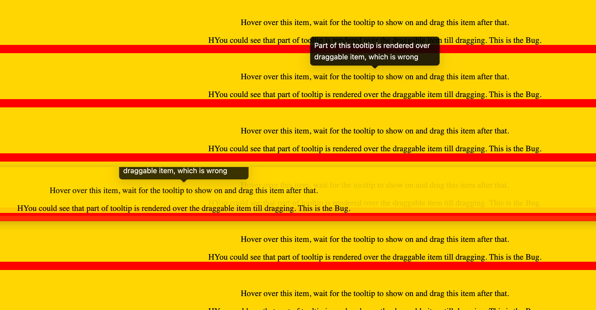

# antd.Tooltip + react-dnd bug

There is a bug when tooltip is rendered over the draggable element.

## How to run demo

1. Install packages via `npm i`
2. Run dev server via `npm run start`
3. Open [localhost:3000](http://localhost:3000) at Chrome

## How to reproduce from this repository

1. Hover over any text on the page
2. Wait till Tooltip is rendered over it
3. Drag text away
4. See how part of tooltip is cropped and dragged after the text, which is unexpected and not desirable.

# Screenshot

*It was made at Chrome 130.0.6723.70 (arm64), MacOS Sohoma 14.1 (23B2073))*

